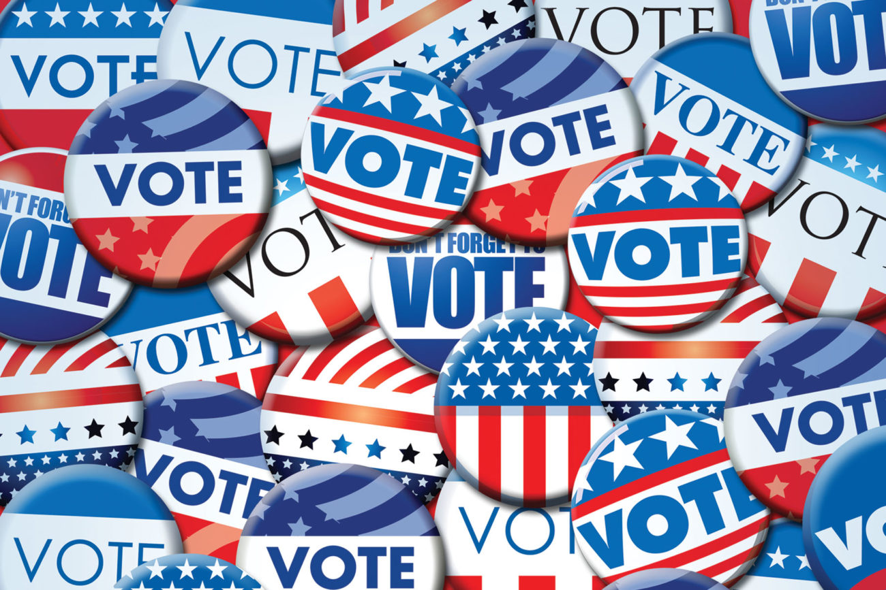
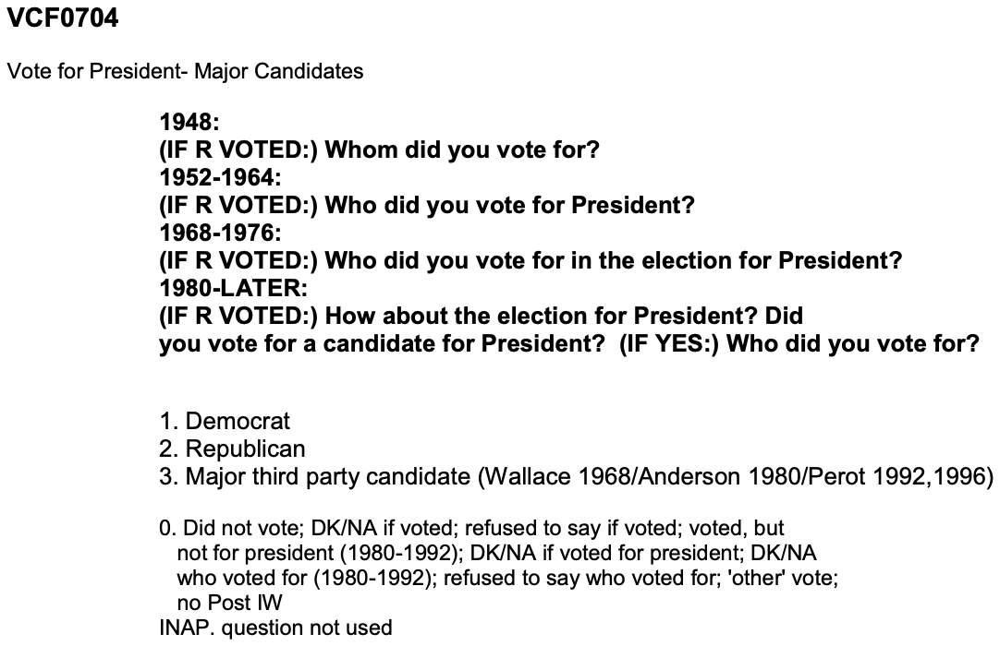
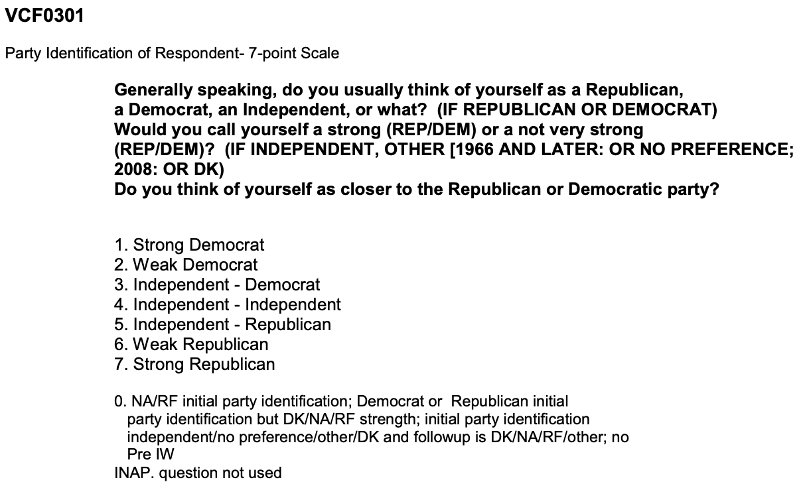
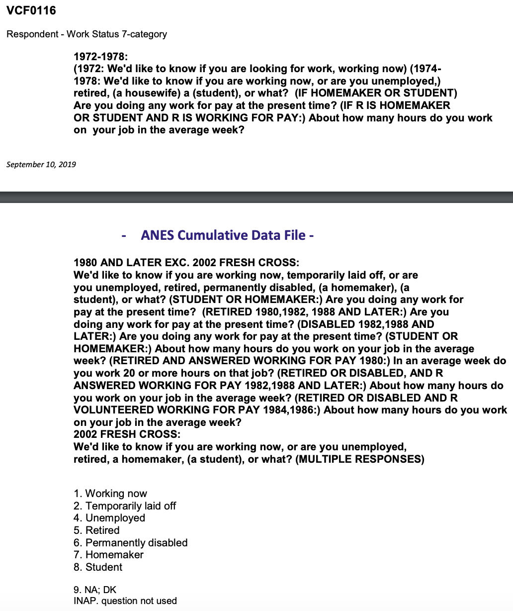
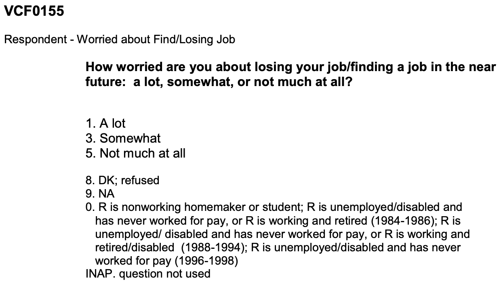

```{r setup, include=FALSE}
knitr::opts_chunk$set(echo = TRUE,warning = FALSE, message = FALSE)
```

##Introduction
This year, 2020 is the election year. We are currently facing a world-wide pendamic that has affected lives of lots of people. The election coming soon is not only the focus for US citizens, but also the focus point for the whole world. How people's voting behaviors change in years that big events happen? The first event came up to my mind was the Economic Crisis happened in 2008. Interestingly, 2008 was also an election year. So in this project, I will do analysis on people's voting behaviors in 2008.




```{r check&load libraries, warning=FALSE, message=FALSE, include=FALSE}
packages.used<-as.list(
  c("tidyverse",
    "haven",
    "ggplot2"))

check.pkg<-function(x){
  if(!require(x,character.only=T))
    install.packages(x,character.only=T,dependence=T)}

#check if packages needed are installed
lapply(packages.used, check.pkg)

#load packages
library(tidyverse)
library(haven)
library(ggplot2)
```


##About the Data
The data used in this project is the survey responses of voters in the U.S. collected by the American National Election Studies (ANES). The time series cumulative data of ANES contain responses from different years, on selected questions related to political behaviors. The codebook files under the data folder can help understand the survey variables and more details.

```{r read in data, warning=FALSE, message=FALSE, include=FALSE}
#Import data
anes<-read_sav("../data/anes_timeseries_cdf.sav")
```

##Analysis & Visualization
I conducted some exploratory data analysis to answer three interesting questions.

Question 1. Was there a change in voting behavior in 2008? <br>
Question 2. Did partisanship affect the change? <br>
Question 3. Was the change related to employment? <br>

###Question 1: Was there a change in voting behavior in 2008?
To answer this question, I investigated in the respondents' voting choices for the president during 1952-2016. The related survey question is asked in the ways shown below.



The major parties are the Democrat and Republican, so I mainly focused on votings for these two.

```{r labelled variables subset, warning=FALSE, message=FALSE, include=FALSE}
#years that surveys conducted
Election_years=as.character(seq(1952, 2016, 4))

#converting labelled data to factor, filter nonNA votes for Democrat and Republican
anes_use=anes%>%
  mutate(year=as_factor(VCF0004),
         vote=as_factor(VCF0704))%>%
  filter(year %in% Election_years)%>%
  filter(!is.na(vote))%>%
  filter((vote=="1. Democrat") | (vote=="2. Republican"))

save(anes_use, file="../output/data_use.RData")
```

The interest is, in each year, how the proportions of respondents voting for Democrat and Republican compare.
```{r vote analysis data, warning=FALSE, message=FALSE, include=FALSE}
#get the proportion of votes for each party every year
anes_vote<-anes_use%>%
  group_by(year)%>%
  count(vote)%>%
  mutate(prop=n/sum(n))

save(anes_vote, file="../output/data_use.RData")
```

```{r vote analysis visualization, warning=FALSE, message=FALSE, echo=FALSE}
#represent data in a barplot
ggplot(anes_vote, aes(x=year, y=prop, fill=vote)) +
  geom_bar(stat="identity",colour="black")+ 
  scale_fill_manual(values=c("lightskyblue", "salmon"))+
  labs(title="What party did the respondents vote for in the elections over the years?")+
  theme_bw()

#specific proportions
anes_vote%>%filter(year==2004 | year==2008)
```


In the graph above, the blue color represents Democrat and red represents Republican. We can see that the porportions are changing every year. Notice that in 2004, the proportion of respondents voting for Democrat was very close to 0.5, so it was also close to the proportion of respondents voting for Republican. However, in 2008, there was a very obvious change in the proportions. About 2/3 of respondents voted for Democrat and 1/3 voted for Republican. And we all know that the elected president in 2008 is from the Democratic party. Hence, there was a change in voting behavior in 2008.

Then, what are the factors contribute to this change?


###Question 2: Does partisanship affect the change?
The variable of interest in this question is Party Identification of Respondent, as describe below.



```{r vote-party analysis data, warning=FALSE, message=FALSE, include=FALSE}
#converting labelled variable VCF0301 to factor, filter nonNA responses in 2004 and 2008
anes_party<-anes_use%>%
  mutate(party=as_factor(VCF0301))%>%
  filter(year %in% c(2004,2008))%>%
  filter(!is.na(party))

#each year, for each of the seven party-identification categories, get the proportion of the vote for 2 parites
anes_party<-anes_party%>%
  group_by(year,party)%>%
  count(vote)%>%
  mutate(prop=n/sum(n))

save(anes_party, file="../output/data_use.RData")
```

```{r vote-party visualization, warning=FALSE, message=FALSE, echo=FALSE}
#visualize the proportion
ggplot(anes_party, 
       aes(x=year, y=prop, fill=vote)) +
  geom_bar(stat="identity", colour="black") + theme_bw()+
  facet_wrap(~party, ncol=1)+
  scale_fill_manual(values=c("lightskyblue", "salmon"))+
  coord_flip()+
  theme(axis.text.x = element_text(angle = 90))+
  theme_bw()+
  labs(title="What party did respondents with different partisanship vote for?")
```


Still, blue represents Democrat and red represents Republican. We can see the trend that people who identified themselves towards Democrat voted for Democrat, and who identified themselves towards Republican voted for Republican. We can also see that from 2004 to 2008, in each identification category, the proportions of respondents voting for Democrat had an increase. Especially for the respondents who identified themselves as 5. Independent - Republican and 4. Independent - Independent, their proportion changes were larger comparing to others. So for respondents who did not have a partisanship and a partisanship very very weak to Republican, the proportion of them voting for Democrat increased relitively more from 2004 to 2008.


###Question 3. Was the change related to employment?
Back to the economic aspect, when we talk about economy, one important thing is employment. The next variables of interest are Work Status and Worry about Find/Losing job, as describe below.

          

```{r work-vote analysis data, warning=FALSE, message=FALSE, include=FALSE}
#converting labelled variables VCF0116 and VCF0155 to factors, filter nonNA responses in 2004 and 2008
anes_work=anes_use%>%
  mutate(work=as_factor(VCF0116),
         worry=as_factor(VCF0155))%>%
  filter(year %in% c(2004,2008))%>%
  filter(!is.na(work) & !is.na(worry))

save(anes_work, file="../output/data_use.RData")
```

<br><br><br>
Did the working status in these two years change in general?


```{r work status-vote visualization, warning=FALSE, message=FALSE, echo=FALSE}
#what are the working status in 2004 and 2008
anes_workstatus<-anes_work%>%
  group_by(year)%>%
  count(work)%>%
  mutate(prop=n/sum(n))

save(anes_workstatus, file="../output/data_use.RData")

#visualize
ggplot(anes_workstatus, 
       aes(x=year, y=prop, fill=work))+
  geom_bar(stat="identity", colour="black")+ 
  theme_bw()+
  labs(title="What work status did respondents have?")
```


We can see from the graph, in 2008, among the survey participants, the proportion of non-working expanded, especially the unemployed group.


```{r unemploy-vote visualization, warning=FALSE, message=FALSE, echo=FALSE}

#filter out respondents who are working now, to see the voting proportions each year
anes_unemp<-anes_work%>%
  filter(work!="1. Working now")%>%
  group_by(year)%>%
  count(vote)%>%
  mutate(prop=n/sum(n))

save(anes_unemp, file="../output/data_use.RData")

#visualize
ggplot(anes_unemp, 
       aes(x=year, y=prop, fill=vote))+
  geom_bar(stat="identity", colour="black") + 
  scale_fill_manual(values=c("lightskyblue", "salmon"))+
  theme_bw()+
  labs(title="What party did non-working respondents vote for?")
```


This graph shows the proportions of votings for Democrat and Republican for respondents who chose working status other than "1. Working now" in 2004 and 2008. Among respondents not working, the proportion that they voted for Democrat increased from 2004 to 2008.


Similar for respondents' worries about finding/losing job.


```{r worry-vote visualization, warning=FALSE, message=FALSE, echo=FALSE}
#what are the working status in 2004 and 2008
anes_worrytatus<-anes_work%>%
  group_by(year)%>%
  count(worry)%>%
  mutate(prop=n/sum(n))

save(anes_worrytatus, file="../output/data_use.RData")

#visualize
ggplot(anes_worrytatus, 
       aes(x=year, y=prop, fill=worry))+
  geom_bar(stat="identity", colour="black")+ 
  theme_bw()+
  labs(title="What worry status did respondents have?")

#filter out respondents who are somewhat/lot worried, to see the voting proportions each year
anes_worry<-anes_work%>%
  filter(worry!="5. Not much at all")%>%
  group_by(year)%>%
  count(vote)%>%
  mutate(prop=n/sum(n))

save(anes_worry, file="../output/data_use.RData")

#visualize
ggplot(anes_worry, 
       aes(x=year, y=prop, fill=vote))+
  geom_bar(stat="identity", colour="black") +   
  scale_fill_manual(values=c("lightskyblue", "salmon"))+
  theme_bw()+
  labs(title="What party did some/a lot worried respondents vote for?")
```


In 2008, the proportion of people who are somewhat or a lot worried about finding/losing job expanded. The proportion that respondents who did not choose "5. Not much at all" voted for Democrat increased from 2004 to 2008.

Hence, some of the respondents who were not working or worried about finding/losing job, contributed to the increase of Democrat votes.


##Limitation
There are some limitations for this project.

####1. Sample size
```{r, warning=FALSE, message=FALSE, echo=FALSE}
barplot(table(anes$VCF0004),
        main="Number of respondents over the years")
```

The graph above indicated the sample sizes of the survey each year. Except 2012 and 2016, the number of respondents each year is less than 3000, and after filtering out the variables we do not want, the sample size actually gets smaller. Given the population of the whole country, the respondents must be not that representative of people's voting behaviors. There might be some over and under estimations. Also, when I looked close to the variables (questions) in this survey, many of them are not asked evey year, making continuous analysis not very convenient.


####2. Response Bias
For variables like VCF0303, Party Identification, questions like this with many scales may not be very easy to answer. If someone initially choose independent but after a few seconds, the respondents reallize that they sometimes tend to be Democrat and sometimes tend to be Republican, what would be the final answer? Also, the difference between weak and strong may also be difficult to recognize and define. This bias may be misleading in some cases.


##Conclusion
A voting decision could be determined by lots of aspects and people's minds are always unpredictable. In this project, among ANES respondents, there was an increase of the proportion that people voted for Democrat in 2008, comparing to in 2004. For respondents identified their partisanship as independent and independent-to-Republican, the proportion that they voted for Democrat also had a relative increase from 2004 to 2008. The proportion of respondents who were unemployed and worried about finding/losing job increased in 2008, and among them, the proportion thay they voted for Democrat also increased.


<br><br><br><br>

